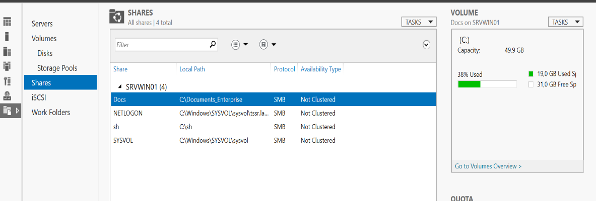
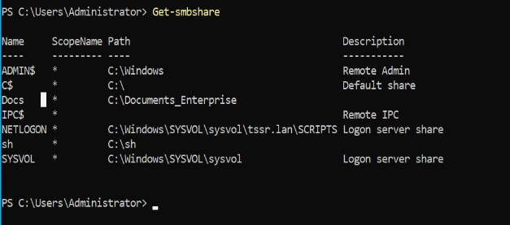
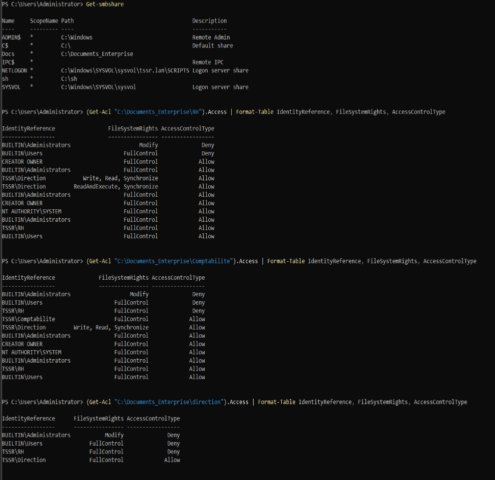
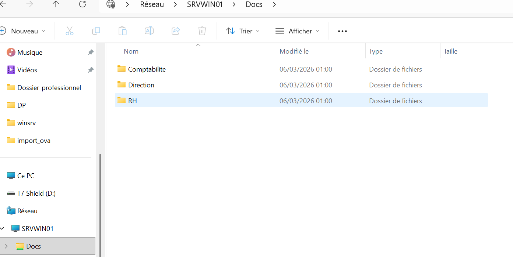
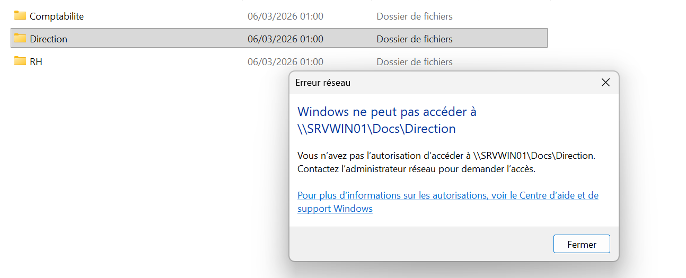

# Windows File Sharing
---
##Configuration d'un serveur de fichiers SMB sur **Windows Server 2022** avec gestion des permissions NTFS par groupe Active Directory.

### Partage SMB côté serveur (Server Manager)

### Vérification du partage avec Get-SmbShare

### Permissions NTFS avec Get-Acl

### Accès client via `\\SRVWIN01\Docs`

### Test de restriction d'accès (accès refusé au dossier Direction)

---
## 🛠️ Commandes PowerShell clés

# Création du partage
New-SmbShare -Name "Docs" -Path "C:\Documents_Enterprise" -FullAccess "Everyone"

# Vérification des partages
Get-SmbShare

# Vérification des permissions NTFS
(Get-Acl "C:\Documents_Enterprise\RH").Access | Format-Table IdentityReference, FileSystemRights, AccessControlType

# Mapper un lecteur réseau (côté client)
New-PSDrive -Name "Z" -PSProvider FileSystem -Root "\\SRVWIN01\Docs" -Persist

## ✅ Résultat

Les permissions NTFS sont correctement appliquées : chaque groupe accède uniquement aux dossiers autorisés, l'accès est refusé pour les autres.
