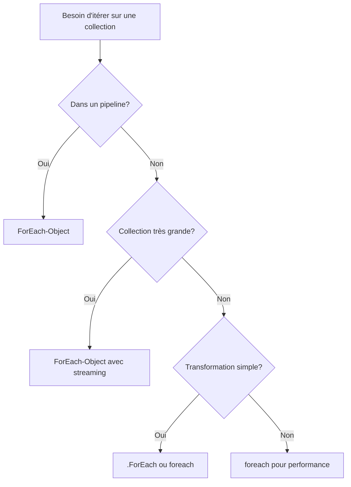

## 📑 Table des matières

```table-of-contents
title: 
style: nestedList # TOC style (nestedList|nestedOrderedList|inlineFirstLevel)
minLevel: 2 # Include headings from the specified level
maxLevel: 2 # Include headings up to the specified level
include: 
exclude: 
includeLinks: true # Make headings clickable
hideWhenEmpty: false # Hide TOC if no headings are found
debugInConsole: false # Print debug info in Obsidian console
```

---

## 🎯 Introduction

PowerShell offre trois façons principales d'itérer sur des collections : la **boucle foreach**, le **cmdlet ForEach-Object**, et la **méthode .ForEach()**. Chacune a ses avantages et ses cas d'usage spécifiques, principalement liés à la gestion de la mémoire et au pipeline.

> [!info] Pourquoi trois options ? Ces trois approches existent pour répondre à des besoins différents :
> 
> - **foreach** : performance maximale pour les collections déjà en mémoire
> - **ForEach-Object** : traitement en streaming via le pipeline
> - **.ForEach()** : syntaxe concise pour opérations simples

---

## 🔁 La boucle foreach

### Syntaxe de base

La boucle `foreach` est une structure de contrôle native de PowerShell qui parcourt une collection d'objets.

```powershell
foreach ($item in $collection) {
    # Code à exécuter pour chaque élément
    Write-Host $item
}
```

> [!example] Exemple simple
> 
> ```powershell
> $nombres = 1..5
> foreach ($nombre in $nombres) {
>     Write-Host "Nombre : $nombre"
> }
> 
> # Résultat :
> # Nombre : 1
> # Nombre : 2
> # Nombre : 3
> # Nombre : 4
> # Nombre : 5
> ```

### Variable d'itération

La variable d'itération (ici `$item` ou `$nombre`) est locale à la boucle et prend successivement la valeur de chaque élément de la collection.

```powershell
# Parcourir un tableau d'objets
$utilisateurs = @(
    [PSCustomObject]@{Nom="Alice"; Age=30},
    [PSCustomObject]@{Nom="Bob"; Age=25},
    [PSCustomObject]@{Nom="Charlie"; Age=35}
)

foreach ($user in $utilisateurs) {
    Write-Host "$($user.Nom) a $($user.Age) ans"
}
```

> [!tip] Astuce : Nommage des variables Utilisez des noms de variables singuliers pour l'itérateur et pluriels pour la collection :
> 
> - `foreach ($fichier in $fichiers)`
> - `foreach ($utilisateur in $utilisateurs)`
> - `foreach ($processus in $processusListe)`

### Parcours de tableaux et collections

La boucle `foreach` fonctionne avec n'importe quel objet énumérable :

```powershell
# Tableaux simples
$fruits = @("Pomme", "Banane", "Orange")
foreach ($fruit in $fruits) {
    Write-Host "J'aime les $fruit"
}

# HashTables (dictionnaires)
$config = @{
    Server = "srv01"
    Port = 8080
    SSL = $true
}

foreach ($cle in $config.Keys) {
    Write-Host "$cle : $($config[$cle])"
}

# Résultats de cmdlets
$services = Get-Service
foreach ($service in $services) {
    if ($service.Status -eq 'Running') {
        Write-Host "$($service.Name) est en cours d'exécution"
    }
}
```

### Performance et utilisation en mémoire

La boucle `foreach` **charge toute la collection en mémoire** avant de commencer l'itération.

> [!warning] Important : Gestion de la mémoire
> 
> - La collection COMPLÈTE est chargée en mémoire avant le traitement
> - Très performante pour les collections de taille moyenne (< 10 000 éléments)
> - Peut causer des problèmes avec de très grandes collections
> - Plus rapide que ForEach-Object car pas de surcharge du pipeline

```powershell
# ✅ Bon usage : collection de taille raisonnable
$fichiers = Get-ChildItem -Path C:\Logs -Filter "*.log"
foreach ($fichier in $fichiers) {
    # Traitement rapide
}

# ⚠️ À éviter : énorme collection
$tousLesFichiers = Get-ChildItem -Path C:\ -Recurse -File
# Charge potentiellement des millions de fichiers en mémoire !
foreach ($fichier in $tousLesFichiers) {
    # Risque de saturation mémoire
}
```

**Avantages :**

- ✅ Performance maximale (pas de surcharge du pipeline)
- ✅ Syntaxe claire et lisible
- ✅ Accès complet à la collection (peut faire référence à d'autres éléments)

**Inconvénients :**

- ❌ Charge toute la collection en mémoire
- ❌ Ne peut pas être utilisée dans un pipeline
- ❌ Délai avant le début du traitement si la collection est longue à générer

---

## 🔀 Le cmdlet ForEach-Object

### Présentation et syntaxe

`ForEach-Object` (alias : `foreach`, `%`) est un cmdlet qui traite les objets un par un dans le pipeline.

```powershell
# Syntaxe complète
Get-ChildItem | ForEach-Object { Write-Host $_.Name }

# Avec l'alias %
Get-ChildItem | % { Write-Host $_.Name }

# Syntaxe avec -Process
Get-Service | ForEach-Object -Process { 
    if ($_.Status -eq 'Running') { 
        $_.Name 
    } 
}
```

> [!info] La variable $_ Dans `ForEach-Object`, `$_` (ou `$PSItem`) représente l'objet courant du pipeline.

### Utilisation dans le pipeline

`ForEach-Object` est conçu pour être utilisé dans les pipelines PowerShell :

```powershell
# Traitement en chaîne
Get-Process | 
    ForEach-Object { 
        [PSCustomObject]@{
            Nom = $_.Name
            CPU = $_.CPU
            Memoire = [math]::Round($_.WorkingSet / 1MB, 2)
        }
    } | 
    Where-Object { $_.Memoire -gt 100 } |
    Sort-Object -Property Memoire -Descending

# Avec plusieurs cmdlets
1..10 | 
    ForEach-Object { $_ * 2 } |
    ForEach-Object { "Résultat : $_" } |
    Out-File -FilePath "resultats.txt"
```

### Différences avec la boucle foreach

|Aspect|`foreach` (boucle)|`ForEach-Object` (cmdlet)|
|---|---|---|
|**Type**|Structure de contrôle|Cmdlet|
|**Pipeline**|❌ Non utilisable|✅ Conçu pour le pipeline|
|**Mémoire**|Charge tout en mémoire|Streaming (un à la fois)|
|**Performance**|⚡ Plus rapide|🐌 Plus lent (surcharge pipeline)|
|**Variable**|Nom personnalisé|`$_` ou `$PSItem`|
|**Syntaxe**|`foreach ($x in $y)`|`... \| ForEach-Object { }`|
|**Cas d'usage**|Collections en mémoire|Traitement en flux|

```powershell
# Exemple comparatif

# Avec foreach (boucle)
$nombres = 1..100
$resultats = @()
foreach ($nombre in $nombres) {
    $resultats += $nombre * 2
}

# Avec ForEach-Object (cmdlet)
$resultats = 1..100 | ForEach-Object { $_ * 2 }
```

### Quand utiliser l'un ou l'autre

> [!tip] Choisir la bonne approche

**Utilisez `foreach` (boucle) quand :**

- ✅ Vous avez déjà la collection complète en mémoire
- ✅ La performance est critique
- ✅ Vous avez besoin d'accéder à plusieurs éléments simultanément
- ✅ Le code doit être le plus lisible possible

```powershell
# Bon usage de foreach
$utilisateurs = Import-Csv "utilisateurs.csv"
foreach ($user in $utilisateurs) {
    New-ADUser -Name $user.Nom -Email $user.Email
}
```

**Utilisez `ForEach-Object` quand :**

- ✅ Vous travaillez dans un pipeline
- ✅ La collection est potentiellement très grande
- ✅ Vous voulez un traitement en streaming
- ✅ Les résultats d'une cmdlet sont directement traités

```powershell
# Bon usage de ForEach-Object
Get-ChildItem -Path C:\Logs -Recurse | 
    ForEach-Object { 
        if ($_.Length -gt 10MB) {
            Compress-Archive -Path $_.FullName -DestinationPath "$($_.FullName).zip"
        }
    }
```

### Streaming vs chargement en mémoire

Le streaming est l'avantage majeur de `ForEach-Object`.

```powershell
# ❌ foreach : attend que TOUT soit en mémoire
$fichiers = Get-ChildItem -Path C:\Data -Recurse -File
foreach ($fichier in $fichiers) {
    # Ne démarre qu'après avoir listé TOUS les fichiers
    Copy-Item $fichier.FullName -Destination D:\Backup
}

# ✅ ForEach-Object : traite au fur et à mesure
Get-ChildItem -Path C:\Data -Recurse -File |
    ForEach-Object {
        # Démarre dès le premier fichier trouvé
        Copy-Item $_.FullName -Destination D:\Backup
    }
```

> [!example] Illustration du streaming Imaginez un robinet d'eau :
> 
> - **foreach** : remplit d'abord le seau complètement, puis verse le contenu
> - **ForEach-Object** : traite l'eau au fur et à mesure qu'elle coule

**Avantages du streaming :**

- 💾 Utilisation mémoire minimale
- ⏱️ Début immédiat du traitement
- 📊 Adapté aux très grandes collections
- 🔄 Peut traiter des flux infinis

### Paramètres avancés de ForEach-Object

```powershell
# -Begin : exécuté une fois au début
# -Process : exécuté pour chaque objet
# -End : exécuté une fois à la fin

1..5 | ForEach-Object -Begin {
    Write-Host "Début du traitement"
    $total = 0
} -Process {
    Write-Host "Traitement de $_"
    $total += $_
} -End {
    Write-Host "Total : $total"
}

# Résultat :
# Début du traitement
# Traitement de 1
# Traitement de 2
# Traitement de 3
# Traitement de 4
# Traitement de 5
# Total : 15
```

---

## ⚡ La méthode .ForEach()

### Introduction (PowerShell 4+)

Depuis PowerShell 4.0, les collections possèdent une méthode `.ForEach()` qui offre une syntaxe alternative.

```powershell
# Syntaxe de base
$collection.ForEach({ scriptblock })

# Ou avec opérateur membre
$collection.ForEach('PropertyName')
```

### Syntaxe et utilisation

```powershell
# Méthode traditionnelle
$nombres = 1..5
$doubles = $nombres.ForEach({ $_ * 2 })
Write-Host $doubles  # 2 4 6 8 10

# Accès à une propriété
$services = Get-Service
$noms = $services.ForEach('Name')

# Avec expression complexe
$fichiers = Get-ChildItem
$infos = $fichiers.ForEach({
    [PSCustomObject]@{
        Nom = $_.Name
        Taille = $_.Length
        TailleMB = [math]::Round($_.Length / 1MB, 2)
    }
})
```

### Comparaison avec les autres méthodes

```powershell
# Les trois approches pour doubler des nombres

# 1. Boucle foreach
$nombres = 1..5
$resultats = @()
foreach ($n in $nombres) {
    $resultats += $n * 2
}

# 2. ForEach-Object (cmdlet)
$resultats = 1..5 | ForEach-Object { $_ * 2 }

# 3. Méthode .ForEach()
$nombres = 1..5
$resultats = $nombres.ForEach({ $_ * 2 })
```

**Caractéristiques de .ForEach() :**

- ✅ Syntaxe concise et moderne
- ✅ Légèrement plus rapide que ForEach-Object
- ✅ Retourne toujours un résultat (tableau)
- ⚠️ Moins flexible que les autres options
- ⚠️ Requiert PowerShell 4.0+

> [!tip] Quand utiliser .ForEach() ? Idéal pour les transformations simples et rapides d'une collection quand vous voulez une syntaxe concise :
> 
> ```powershell
> # Extraction rapide de propriété
> $noms = $utilisateurs.ForEach('Name')
> 
> # Transformation simple
> $carres = (1..10).ForEach({ $_ * $_ })
> ```

---

## 📊 Comparaisons et cas d'usage

### Tableau récapitulatif complet

|Critère|`foreach`|`ForEach-Object`|`.ForEach()`|
|---|---|---|---|
|**Performance**|⚡⚡⚡ Excellente|🐌 Moyenne|⚡⚡ Bonne|
|**Mémoire**|💾💾💾 Charge tout|💾 Streaming|💾💾 Charge tout|
|**Pipeline**|❌ Non|✅ Oui|❌ Non|
|**Lisibilité**|⭐⭐⭐ Excellente|⭐⭐ Bonne|⭐⭐ Bonne|
|**Flexibilité**|⭐⭐⭐ Maximale|⭐⭐⭐ Maximale|⭐ Limitée|
|**Version PS**|Toutes|Toutes|4.0+|

### Exemples comparatifs détaillés

#### Scénario 1 : Traitement de fichiers

```powershell
# MAUVAIS : foreach avec grande collection
$fichiers = Get-ChildItem -Path C:\ -Recurse -File
foreach ($fichier in $fichiers) {
    # Attend que tous les fichiers soient listés
    $fichier.Name
}

# BON : ForEach-Object pour streaming
Get-ChildItem -Path C:\ -Recurse -File |
    ForEach-Object {
        # Commence immédiatement
        $_.Name
    }

# BON : foreach avec collection limitée
$fichiers = Get-ChildItem -Path C:\Temp -Filter "*.log"
foreach ($fichier in $fichiers) {
    # Performance optimale
    Remove-Item $fichier.FullName
}
```

#### Scénario 2 : Transformation de données

```powershell
$donnees = 1..1000

# Approche 1 : foreach (plus rapide)
$resultats = @()
foreach ($n in $donnees) {
    $resultats += [PSCustomObject]@{
        Nombre = $n
        Carre = $n * $n
    }
}

# Approche 2 : ForEach-Object (pipeline)
$resultats = $donnees | ForEach-Object {
    [PSCustomObject]@{
        Nombre = $_
        Carre = $_ * $_
    }
}

# Approche 3 : .ForEach() (syntaxe concise)
$resultats = $donnees.ForEach({
    [PSCustomObject]@{
        Nombre = $_
        Carre = $_ * $_
    }
})
```

#### Scénario 3 : Pipeline complexe

```powershell
# ForEach-Object est idéal ici
Get-Service | 
    Where-Object { $_.Status -eq 'Running' } |
    ForEach-Object {
        [PSCustomObject]@{
            Service = $_.Name
            PID = $_.Id
            Description = $_.DisplayName
        }
    } |
    Where-Object { $_.Service -like "Win*" } |
    Sort-Object Service |
    Export-Csv "services.csv" -NoTypeInformation
```

### Guide de décision



> [!tip] Règle d'or
> 
> - **Pipeline** → `ForEach-Object`
> - **Performance critique** → `foreach`
> - **Syntaxe concise** → `.ForEach()`
> - **Grande collection** → `ForEach-Object`
> - **Lisibilité maximale** → `foreach`

---

## ⚠️ Pièges courants

### 1. Confusion entre foreach et ForEach-Object

```powershell
# ❌ ERREUR : tentative d'utiliser foreach dans un pipeline
Get-Service | foreach ($service in $_) { 
    # Ceci NE FONCTIONNE PAS !
}

# ✅ CORRECT : utiliser ForEach-Object
Get-Service | ForEach-Object { 
    Write-Host $_.Name
}

# ✅ CORRECT : utiliser foreach en dehors du pipeline
$services = Get-Service
foreach ($service in $services) {
    Write-Host $service.Name
}
```

### 2. Modification de collection pendant l'itération

```powershell
# ❌ DANGEREUX : modifier la collection pendant l'itération
$nombres = 1..5
foreach ($n in $nombres) {
    if ($n -eq 3) {
        $nombres += 10  # Peut causer des comportements imprévisibles
    }
}

# ✅ CORRECT : créer une nouvelle collection
$nombres = 1..5
$nouveauxNombres = @()
foreach ($n in $nombres) {
    if ($n -eq 3) {
        $nouveauxNombres += 10
    }
    $nouveauxNombres += $n
}
```

### 3. Utilisation inefficace de += dans foreach

```powershell
# ❌ TRÈS LENT : += recrée le tableau à chaque itération
$resultats = @()
foreach ($i in 1..10000) {
    $resultats += $i  # Coût : O(n²)
}

# ✅ MEILLEUR : utiliser une ArrayList
$resultats = [System.Collections.ArrayList]::new()
foreach ($i in 1..10000) {
    [void]$resultats.Add($i)  # Coût : O(n)
}

# ✅ OPTIMAL : ForEach-Object avec retour automatique
$resultats = 1..10000 | ForEach-Object { $_ }
```

### 4. Oubli du $ avec la variable d'itération

```powershell
# ❌ ERREUR : oubli du $
foreach (nombre in $nombres) {
    Write-Host nombre
}

# ✅ CORRECT
foreach ($nombre in $nombres) {
    Write-Host $nombre
}
```

### 5. Mauvaise utilisation de .ForEach() avec contrôles de flux

```powershell
# ❌ Ne fonctionne pas : break/continue dans .ForEach()
$nombres = 1..10
$nombres.ForEach({
    if ($_ -eq 5) {
        break  # ERREUR : break non supporté
    }
    Write-Host $_
})

# ✅ CORRECT : utiliser foreach ou ForEach-Object
foreach ($n in $nombres) {
    if ($n -eq 5) {
        break  # Fonctionne
    }
    Write-Host $n
}
```

---

## ✅ Bonnes pratiques

### 1. Nommage clair des variables

```powershell
# ✅ BON : nommage explicite
foreach ($utilisateur in $utilisateurs) {
    Write-Host $utilisateur.Nom
}

# ❌ À ÉVITER : nom générique
foreach ($u in $utilisateurs) {
    Write-Host $u.Nom
}

# ✅ BON : contexte clair
foreach ($fichierLog in $fichiersLogs) {
    Remove-Item $fichierLog.FullName
}
```

### 2. Utiliser le bon outil pour le bon contexte

```powershell
# ✅ foreach pour performance
$utilisateurs = Import-Csv "data.csv"
foreach ($user in $utilisateurs) {
    New-ADUser -Name $user.Name
}

# ✅ ForEach-Object pour pipeline
Get-ChildItem *.txt | 
    ForEach-Object { 
        Get-Content $_.FullName 
    } |
    Where-Object { $_ -match "ERROR" }

# ✅ .ForEach() pour extraction simple
$noms = $utilisateurs.ForEach('Name')
```

### 3. Gérer les collections nulles

```powershell
# ✅ BON : vérification avant itération
$fichiers = Get-ChildItem -Path $chemin -ErrorAction SilentlyContinue
if ($fichiers) {
    foreach ($fichier in $fichiers) {
        # Traitement sécurisé
    }
} else {
    Write-Warning "Aucun fichier trouvé"
}

# ✅ BON : avec opérateur null-coalescing (PS 7+)
$fichiers = Get-ChildItem -Path $chemin -ErrorAction SilentlyContinue
foreach ($fichier in $fichiers ?? @()) {
    # Traitement sécurisé avec tableau vide par défaut
}
```

### 4. Privilégier la lisibilité

```powershell
# ❌ Compact mais peu lisible
$r = 1..100 | % { $_ * 2 } | ? { $_ -gt 50 } | Sort | Select -First 10

# ✅ Clair et maintenable
$nombres = 1..100
$doubles = $nombres | ForEach-Object { $_ * 2 }
$filtres = $doubles | Where-Object { $_ -gt 50 }
$tries = $filtres | Sort-Object
$resultats = $tries | Select-Object -First 10
```

### 5. Optimiser pour la performance quand nécessaire

```powershell
# Pour les GRANDES collections (> 10 000 éléments)

# ⚡ Plus rapide : foreach
Measure-Command {
    $nombres = 1..50000
    $resultats = @()
    foreach ($n in $nombres) {
        $resultats += $n * 2
    }
}

# 🐌 Plus lent : ForEach-Object
Measure-Command {
    $resultats = 1..50000 | ForEach-Object { $_ * 2 }
}

# ⚡ Compromis : .ForEach()
Measure-Command {
    $nombres = 1..50000
    $resultats = $nombres.ForEach({ $_ * 2 })
}
```

### 6. Documentation et commentaires

```powershell
# ✅ BON : intention claire
# Traite chaque fichier log de manière séquentielle
# pour éviter la surcharge mémoire
Get-ChildItem -Path C:\Logs -Filter "*.log" |
    ForEach-Object {
        # Compresse les logs de plus de 10MB
        if ($_.Length -gt 10MB) {
            Compress-Archive -Path $_.FullName -DestinationPath "$($_.FullName).zip"
            Remove-Item $_.FullName
        }
    }
```

### 7. Gestion d'erreurs appropriée

```powershell
# ✅ BON : gestion d'erreurs dans la boucle
foreach ($fichier in $fichiers) {
    try {
        $contenu = Get-Content $fichier.FullName -ErrorAction Stop
        # Traitement...
    }
    catch {
        Write-Warning "Erreur avec $($fichier.Name): $_"
        continue
    }
}

# ✅ BON : avec ForEach-Object
Get-ChildItem *.txt | ForEach-Object {
    try {
        Get-Content $_.FullName -ErrorAction Stop
    }
    catch {
        Write-Warning "Erreur avec $($_.Name): $_"
    }
}
```

---

> [!info] Résumé
> 
> - **foreach** : boucle native, performance maximale, charge tout en mémoire
> - **ForEach-Object** : cmdlet de pipeline, streaming, flexible
> - **.ForEach()** : méthode moderne, syntaxe concise, PS 4.0+
> 
> Choisissez en fonction du contexte : pipeline, taille de collection, et besoins de performance.